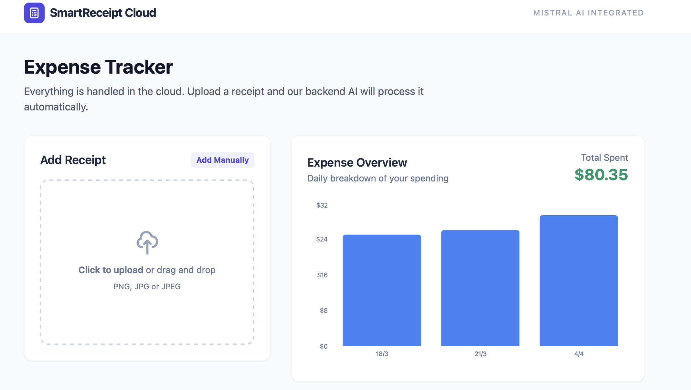
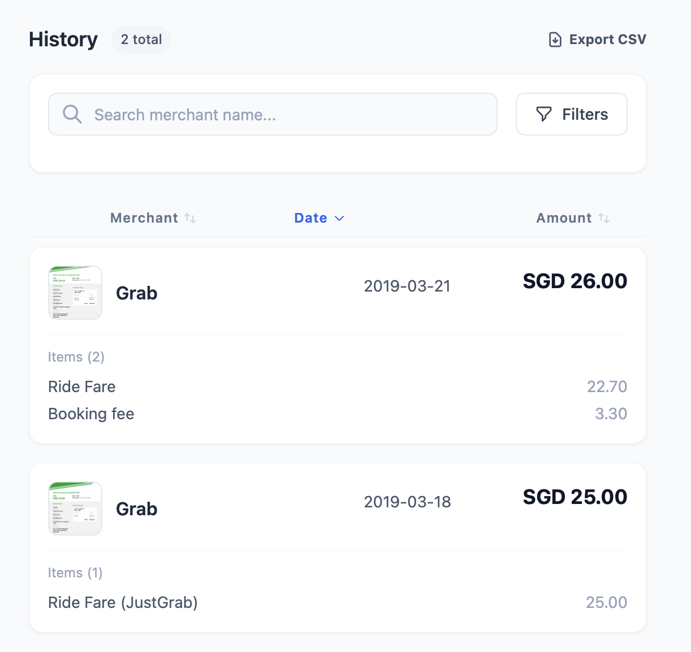

# 🧾 SmartReceipt - AI-Powered Expense Tracker

<div align="center">


**Transform receipt images into structured expense data with AI-powered OCR**

[Demo](#-demo) • [Features](#-features) • [Quick Start](#-quick-start) • [Documentation](#-documentation)

</div>

---

## Demo




## 📖 Overview

SmartReceipt is a modern, cloud-native expense tracking application that uses **Mistral AI** to automatically extract and structure receipt data. Simply upload a receipt image, and let AI handle the rest - no manual data entry required!

### 🎯 Key Highlights

- 🤖 **AI-Powered OCR** - Mistral AI extracts text from receipt images
- 🧠 **Smart Parsing** - LLM structures data automatically (merchant, date, items, total)
- ☁️ **Cloud Backend** - Serverless architecture on AWS Lambda or Vercel
- 📊 **Rich Dashboard** - Beautiful statistics and expense visualization
- 🔍 **Advanced Filtering** - Search and filter by merchant, amount, date range
- 📥 **CSV Export** - Download your expense data anytime
- ✍️ **Manual Entry** - Optionally add receipts manually
- 💾 **Persistent Storage** - DynamoDB for data, S3 for images

---

## ✨ Features

### 🎨 Frontend

- **Modern React UI** with TypeScript
- **Responsive Design** - Works on desktop and mobile
- **Real-time Processing** - See results instantly
- **Interactive Charts** - Expense statistics with Recharts
- **Filter & Search** - Find receipts quickly
- **Drag & Drop Upload** - Easy image handling

### 🚀 Backend

- **Serverless Architecture** - AWS Lambda or Vercel Functions
- **Mistral AI Integration** - Vision API for OCR + LLM for parsing
- **AWS Services** - DynamoDB + S3 for storage
- **RESTful API** - Clean endpoint design
- **Local Dev Mode** - In-memory storage for development
- **CORS Enabled** - Ready for frontend integration

### 🔒 Production Ready

- ✅ Environment-based configuration
- ✅ Error handling and validation
- ✅ TypeScript for type safety
- ✅ Optimized build pipeline
- ✅ Secure AWS IAM policies
- ✅ Public S3 bucket for images

---

## 🏗️ Architecture

```
┌─────────────┐
│   User App  │
│  (React)    │
└──────┬──────┘
       │
       ▼
┌─────────────────┐
│  API Gateway    │
│  /api/*         │
└──────┬──────────┘
       │
       ▼
┌─────────────────────────────────────┐
│         Lambda Functions            │
│  ┌─────────────────────────────┐   │
│  │  Process Receipt            │   │
│  │  (OCR + Parse + Save)       │   │
│  └─────────────────────────────┘   │
│  ┌─────────────────────────────┐   │
│  │  Manual Entry / Get / Delete│   │
│  └─────────────────────────────┘   │
└──────┬──────────────────┬───────────┘
       │                  │
       ▼                  ▼
┌─────────────┐    ┌─────────────┐
│  Mistral AI │    │  DynamoDB   │
│  OCR + LLM  │    │  + S3       │
└─────────────┘    └─────────────┘
```

### Data Flow

1. **Upload** → User uploads receipt image
2. **S3 Storage** → Backend saves image to S3
3. **OCR** → Mistral AI extracts text from image
4. **Parse** → Mistral LLM structures text into JSON
5. **Store** → Receipt data saved to DynamoDB
6. **Display** → Frontend shows structured receipt

---

## 🚀 Quick Start

### Prerequisites

- **Node.js 20.x LTS** or higher ([Download here](https://nodejs.org/))
- npm 10.x or higher (comes with Node.js)
- AWS Account (for production deployment)
- Mistral AI API Key ([Get one here](https://console.mistral.ai/))

### 1️⃣ Clone & Install

```bash
# Clone the repository
git clone https://github.com/SophiaSama/SmartReceiptReader.git
cd SmartReceiptReader

# Install frontend dependencies
npm install

# Install backend dependencies
cd backend
npm install
cd ..
```

### 2️⃣ Configure Environment

```bash
# Navigate to backend directory
cd backend

# Copy environment template
copy .env.example .env

# Edit .env file
notepad .env
```

**Add your Mistral API key:**

```bash
MISTRAL_API_KEY=your_actual_mistral_api_key_here
USE_LOCAL_STORAGE=true
PORT=3001
```

### 3️⃣ Build Backend

```bash
# From backend directory
npm run build
```

### 4️⃣ Run Development Servers

```bash
# Terminal 1: Start backend (from backend directory)
npm run dev

# Terminal 2: Start frontend (from project root)
cd ..
npm run dev
```

### 5️⃣ Open Application

Navigate to: **<http://localhost:3000>**

---

## 📦 Project Structure

```
SmartReceiptReader/
├── 📄 App.tsx                    # Main React application
├── 📄 index.tsx                  # React entry point
├── 📄 styles.css                 # Global styles
├── 📄 types.ts                   # TypeScript definitions
├── 📄 vite.config.ts             # Vite configuration
├── 📄 package.json               # Frontend dependencies
├── 📄 vercel.json                # Vercel deployment config
├── 📄 postcss.config.cjs         # PostCSS config
├── 📄 tailwind.config.cjs        # Tailwind config
│
├── 📁 components/                # React components
│   ├── UploadSection.tsx         # File upload UI
│   ├── ReceiptList.tsx           # Receipt display
│   ├── StatsOverview.tsx         # Expense charts
│   ├── ManualEntryForm.tsx       # Manual input
│   └── ReceiptFilters.tsx        # Search & filter
│
├── 📁 services/                  # Frontend services
│   ├── awsService.ts             # API communication
│   └── geminiService.ts          # (Legacy)
│
├── 📁 api/                       # Vercel Serverless Functions
│   ├── process.ts                # POST /api/process (receipt OCR)
│   ├── health.ts                 # GET /api/health (health check)
│   ├── receipts.ts               # GET /api/receipts (list all)
│   └── receipts/                 # Receipt sub-routes
│       ├── manual.ts             # POST /api/receipts/manual (manual entry)
│       └── delete.ts             # DELETE /api/receipts/delete (delete by ID)
│
└── 📁 backend/                   # Backend code (AWS Lambda / Local)
    ├── 📄 package.json           # Backend dependencies
    ├── 📄 template.yaml          # AWS SAM template
    ├── 📄 tsconfig.json          # TypeScript config
    ├── 📄 .env.example           # Environment template
    │
    ├── 📁 src/
    │   ├── 📁 handlers/          # Lambda functions
    │   │   ├── processReceipt.ts # Main OCR endpoint
    │   │   ├── manualSave.ts     # Manual entry
    │   │   ├── getReceipts.ts    # Fetch all
    │   │   └── deleteReceipt.ts  # Delete receipt
    │   │
    │   ├── 📁 services/          # Business logic
    │   │   ├── mistralService.ts # AI integration
    │   │   ├── s3Service.ts      # Image storage
    │   │   └── dynamoService.ts  # Database
    │   │
    │   └── 📁 utils/             # Helpers
    │       ├── parseMultipart.ts # Form parsing
    │       └── responseHelper.ts # API responses
    │
    ├── 📁 dist/                  # Compiled JavaScript (generated)
    └── 📁 local/                 # Local development
        └── server.ts             # Express server
```

---

## 🔌 API Endpoints

### `POST /api/process`

Process receipt image with AI

**Request:**

- Content-Type: `multipart/form-data`
- Body: `file` (image)

**Response:**

```json
{
  "id": "uuid",
  "merchantName": "Whole Foods",
  "date": "2026-01-21",
  "total": 87.45,
  "currency": "SGD",
  "items": [...],
  "imageUrl": "https://...",
  "createdAt": 1737475200000
}
```

### `POST /api/receipts/manual`

Save manual receipt entry

**Request:**

- Content-Type: `multipart/form-data`
- Body: `metadata` (JSON string), `file` (optional)

### `GET /api/receipts`

Get all receipts

**Response:** Array of receipt objects

### `DELETE /api/receipts/delete`

Delete receipt and image

**Request:**
- Query Parameter: `id` (receipt ID)

**Response:** 204 No Content

---

## 🌐 Deployment

> **💡 Important:** You do NOT need to manually create Lambda functions! SAM automates everything.  
> See **[AWS_DEPLOYMENT_GUIDE.md](./AWS_DEPLOYMENT_GUIDE.md)** for detailed instructions.

### Deploy to AWS Lambda

```bash
# Build the backend
cd backend
npm run build

# Deploy with SAM CLI (creates all resources automatically)
sam build
sam deploy --guided
```

**What Gets Created Automatically:**

- ✅ 4 Lambda Functions (Process, Manual, Get, Delete)
- ✅ API Gateway with endpoints
- ✅ DynamoDB Table
- ✅ S3 Bucket
- ✅ IAM Roles & Permissions

**Configure During Deployment:**

- Stack name: `smart-receipt-stack`
- AWS Region: `ap-southeast-1` (or your preferred region)
- Mistral API Key: Your key
- Confirm changes: Y

**After deployment:**

- Note the API Gateway endpoint URL from outputs
- Update frontend to use production API (if needed)

📚 **[Read Full AWS Deployment Guide →](./docs/deployment/AWS_DEPLOYMENT_GUIDE.md)**

### Deploy to Vercel

> **🔐 Important:** Vercel needs AWS IAM credentials to access DynamoDB and S3.  
> See **[VERCEL_DEPLOYMENT_GUIDE.md](./VERCEL_DEPLOYMENT_GUIDE.md)** for complete setup including project structure, IAM policies, and environment configuration.

```bash
# Install Vercel CLI
npm install -g vercel

# Deploy from project root
vercel
```

**Prerequisites:**

1. ✅ Create IAM user with DynamoDB + S3 permissions
2. ✅ Create DynamoDB table: `smart-receipts`
3. ✅ Create S3 bucket: `smart-receipt-images-{account-id}`

**Environment Variables in Vercel Dashboard:**

- `MISTRAL_API_KEY` - Your Mistral API key
- `USE_LOCAL_STORAGE` - `false` (use AWS services)
- `AWS_REGION` - `ap-southeast-1` (your AWS region)
- `AWS_ACCESS_KEY_ID` - IAM user access key
- `AWS_SECRET_ACCESS_KEY` - IAM user secret key
- `S3_BUCKET_NAME` - Your S3 bucket name
- `DYNAMODB_TABLE_NAME` - `smart-receipts`

📚 **Documentation:**
- **[docs/deployment/VERCEL_DEPLOYMENT_GUIDE.md](./docs/deployment/VERCEL_DEPLOYMENT_GUIDE.md)** - Complete deployment setup
- **[docs/development/VERCEL_DEVELOPMENT_GUIDE.md](./docs/development/VERCEL_DEVELOPMENT_GUIDE.md)** - Best practices & troubleshooting

---

## 🛠️ Technology Stack

### Frontend

- **React 19.2** - UI framework
- **TypeScript 5.8** - Type safety
- **Vite 6.2** - Build tool & dev server
- **Recharts 3.6** - Charts & visualization
- **Tailwind CSS** - Styling (utility-first)

### Backend

- **Node.js 18+** - Runtime
- **Express 4.18** - Local development server
- **TypeScript 5.3** - Type safety
- **Mistral AI SDK** - AI integration
- **AWS SDK v3** - DynamoDB & S3
- **Busboy** - Multipart form parsing
- **Multer** - File upload handling

### Infrastructure

- **AWS Lambda** - Serverless compute
- **AWS API Gateway** - REST API
- **AWS DynamoDB** - NoSQL database
- **AWS S3** - Image storage
- **AWS SAM** - Infrastructure as Code
- **Vercel** - Alternative deployment

---

## 📚 Documentation

### Deployment Guides

- **[AWS_DEPLOYMENT_GUIDE.md](./AWS_DEPLOYMENT_GUIDE.md)** - Deploy to AWS Lambda with SAM
- **[VERCEL_DEPLOYMENT_GUIDE.md](./VERCEL_DEPLOYMENT_GUIDE.md)** - Deploy to Vercel (includes IAM setup and project structure)
- **[VERCEL_DEVELOPMENT_GUIDE.md](./VERCEL_DEVELOPMENT_GUIDE.md)** - Best practices, common pitfalls, and debugging strategies

### Development Guides

- **[TESTING_GUIDE.md](./TESTING_GUIDE.md)** - Comprehensive testing documentation
- **[tests/README.md](./tests/README.md)** - Test structure and examples

### Technical Reference

- **[BACKEND_API_GUIDE.md](./BACKEND_API_GUIDE.md)** - Backend development guidelines
- **[DYNAMODB_SCHEMA.md](./DYNAMODB_SCHEMA.md)** - Database schema & format
- **[DEPLOYMENT.md](./DEPLOYMENT.md)** - General deployment checklist & troubleshooting
- **[backend/CONFIGURATION.md](./backend/CONFIGURATION.md)** - Environment setup and configuration

---

## 🎮 Usage Examples

### Upload Receipt

1. Click "Add Receipt" area or drag & drop image
2. Wait for AI processing (~3-5 seconds)
3. Review extracted data
4. Receipt appears in history

### Manual Entry

1. Click "Add Manually" button
2. Fill in merchant, date, total
3. Optionally add items
4. Optionally attach image
5. Click "Save Receipt"

### Filter Receipts

1. Use search box for merchant names
2. Set amount range (min/max)
3. Select date range
4. Click "Clear Filters" to reset

### Export Data

1. Click "Export CSV" button
2. CSV file downloads automatically
3. Open in Excel or Google Sheets

---

## 🔧 Development

### Run Tests

```bash
# Run all tests
npm test

# Run integration tests only
npm run test:integration

# Run E2E tests (requires server running)
npm run test:e2e

# Run with UI (interactive)
npm run test:ui

# Generate coverage report
npm run test:coverage
```

See **[TESTING_GUIDE.md](./TESTING_GUIDE.md)** for detailed testing documentation.

### Build for Production

```bash
# Build frontend
npm run build

# Build backend
cd backend
npm run build
```

### Local Storage Mode

For development without AWS:

```bash
# In backend/.env
USE_LOCAL_STORAGE=true
```

This uses in-memory storage - data is lost on server restart.

### Mock AI Mode

For development without Mistral API key:

```bash
# In backend/.env
MISTRAL_API_KEY=your_mistral_api_key_here
# (Keep default value)
```

Backend will return mock OCR results.

---

## 🐛 Troubleshooting

### Frontend loads but API fails

- ✅ Check backend is running on port 3001
- ✅ Verify Vite proxy in `vite.config.ts`
- ✅ Check browser console for errors

### Images not loading

- ✅ Verify S3 bucket CORS configuration
- ✅ Check S3 bucket policy allows public read
- ✅ In local mode: images stored in memory

### AI processing fails

- ✅ Verify Mistral API key is correct
- ✅ Check API quota/limits
- ✅ View backend logs for details

### Data doesn't persist

- ✅ Check `USE_LOCAL_STORAGE` setting
- ✅ For production: use AWS services
- ✅ Verify DynamoDB table exists

See **[docs/deployment/DEPLOYMENT.md](./docs/deployment/DEPLOYMENT.md)** for comprehensive troubleshooting.

---

## 🤝 Contributing

Contributions are welcome! Here's how:

1. Fork the repository
2. Create feature branch (`git checkout -b feature/amazing-feature`)
3. Commit changes (`git commit -m 'Add amazing feature'`)
4. Push to branch (`git push origin feature/amazing-feature`)
5. Open Pull Request

### Development Guidelines

- Follow TypeScript best practices
- Add error handling for new features
- Update documentation for API changes
- Test locally before deploying
- Keep dependencies up to date

---

## 📝 License

This project is licensed under the MIT License - see the [LICENSE](LICENSE) file for details.

---

## 🙏 Acknowledgments

- **Mistral AI** - For powerful OCR and LLM capabilities
- **AWS** - For serverless infrastructure
- **Vercel** - For seamless deployment
- **React Team** - For amazing UI framework
- **TypeScript** - For type safety

---

## 📞 Support

Need help? Check these resources:

- 📖 [Documentation](#-documentation)
- 🐛 [Issue Tracker](https://github.com/SophiaSama/SmartReceiptReader/issues)
- 💬 [Discussions](https://github.com/SophiaSama/SmartReceiptReader/discussions)
- 📧 Email: <wang.ruiping0720@gmail.com>

---

## 🗺️ Roadmap

### Planned Features

- [ ] Multi-user support with authentication
- [ ] Mobile app (React Native)
- [ ] Receipt categories & tags
- [ ] Budget tracking & alerts
- [ ] Integration with accounting software
- [ ] Advanced analytics & reports
- [ ] Receipt splitting for shared expenses
- [ ] Multiple currency support
- [ ] Dark mode theme

---

## 📊 Stats


---

<div align="center">

**Built with ❤️ using Mistral AI, React, and AWS**

Made by [Ruiping Wang](https://github.com/SophiaSama) | January 2026

[⬆ Back to Top](#-smartreceipt---ai-powered-expense-tracker)

</div>
