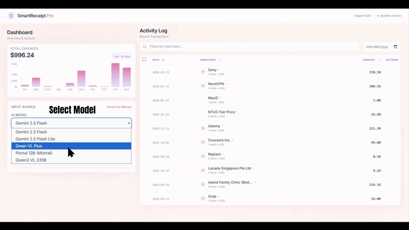

# 🧾 SmartReceipt - AI-Powered Expense Tracker

<div align="center">


**Transform receipt images into structured expense data with AI-powered OCR**

[Demo](#-demo) • [Features](#-features) • [Quick Start](#-quick-start) • [Documentation](#-documentation)

</div>

---

## Demo



## 📖 Overview

SmartReceipt is a modern, cloud-native expense tracking application that uses **Mistral AI** and **OpenRouter-powered models** to automatically extract and structure receipt data. Simply upload a receipt image, choose an AI model if desired, and let AI handle the rest - no manual data entry required! Data lives in **Supabase** (Postgres + Storage) with per-user isolation enforced by Row Level Security.

### 🎯 Key Highlights

- 🤖 **AI-Powered OCR** - Extract text from receipt images with multiple model choices
- 🚀 **Smart OCR Routing** - Dynamically switches between Tesseract (free/local), Hybrid, and Vision LLM based on image quality to optimize for speed and cost
- 🧠 **Smart Parsing** - LLM structures data automatically (merchant, date, items, total)
- 🎛️ **Model Selection** - Choose between Mistral and OpenRouter-backed models
- 🔐 **Email/Password Auth** - Supabase Auth with per-user data isolation (RLS)
- 📊 **Rich Dashboard** - Compact statistics and expense visualization
- 🔍 **Advanced Filtering** - Search and filter by merchant, amount, date range
- 📥 **CSV Export** - Download your expense data anytime
- ✍️ **Manual Entry** - Optionally add receipts manually
- 💾 **Persistent Storage** - Supabase Postgres for data, Supabase Storage for images

---

## ✨ Features

### 🎨 Frontend

- **Modern React UI** with TypeScript
- **Responsive Design** - Works on desktop and mobile
- **Real-time Processing** - See results instantly
- **Interactive Charts** - Expense statistics with Recharts
- **Filter & Search** - Find receipts quickly
- **Drag & Drop Upload** - Easy image handling

### 🚀 Backend

- **Direct-to-Supabase data layer** - The browser talks directly to Supabase REST + Storage for all CRUD; only OCR/AI processing is server-side
- **Smart Routing Pipeline** - 3-phase analysis (quality check → route decision → execution) for optimized processing
- **Multi-Provider AI** - Mistral + OpenRouter models for OCR + parsing
- **Supabase Services** - Postgres + Storage with Row Level Security
- **Stateless OCR endpoint** - `POST /api/process` authenticates the caller's Supabase JWT and writes under that user
- **Local Dev Server** - Lightweight Express server for the processing endpoint
- **CORS Enabled** - Ready for frontend integration

### 🔒 Production Ready

- ✅ Environment-based configuration
- ✅ Error handling and validation
- ✅ TypeScript for type safety
- ✅ Optimized build pipeline
- ✅ Row Level Security (per-user data isolation)
- ✅ Private Storage bucket with signed URLs

---

## 🏗️ Architecture

```
┌─────────────┐
│   User App  │
│  (React)    │
└──────┬──────┘
       │
       ├────────────────────────────┐
       │ Auth + CRUD (REST/Storage)  │ OCR upload (multipart)
       ▼                             ▼
┌─────────────────┐         ┌─────────────────────┐
│    Supabase     │◄────────│  /api/process       │
│  Auth + Postgres│  JWT +  │  (OCR + Parse +     │
│  + Storage (RLS)│  RLS    │   write via user)   │
└─────────────────┘         └──────────┬──────────┘
                                       │
                                       ▼
                            ┌─────────────────────┐
                            │     AI Models       │
                            │ Mistral + OpenRouter │
                            │   + Tesseract OCR   │
                            └─────────────────────┘
```

### Data Flow

1. **Sign in** → User authenticates with email/password (Supabase Auth)
2. **Upload** → User uploads receipt image; the browser sends it to `POST /api/process` with its Supabase JWT
3. **Storage** → Backend uploads the image to the private Supabase Storage bucket under the user's folder
4. **Analyze** → Quick Tesseract scan + contrast/sharpness check for quality assessment
5. **Route** → Choose between **Tesseract** (Fast/Free), **Hybrid**, or **Vision LLM** (Full accuracy) based on image quality
6. **Execute** → Extract text using the chosen OCR route
7. **Parse** → Small LLM structures text into JSON
8. **Store** → Receipt row inserted into Postgres (under the user via RLS) with processing metrics
9. **Display** → Frontend reads the user's receipts directly from Supabase (signed image URLs) and shows optimization stats

---

## 🚀 Quick Start

### Prerequisites

- **Node.js 20.x LTS** or higher ([Download here](https://nodejs.org/))
- npm 10.x or higher (comes with Node.js)
- A **Supabase project** (free tier works) ([supabase.com](https://supabase.com/))
- Mistral AI API Key ([Get one here for free](https://console.mistral.ai/))
- OpenRouter API Key ([Get one here, credits top up needed to make API Calls](https://openrouter.ai/)) (optional; missing key falls back to Mistral)

### 1️⃣ Clone & Install

```bash
# Clone the repository
git clone https://github.com/SophiaSama/SmartReceiptReader.git
cd SmartReceiptReader

# Install frontend dependencies
npm install

# Install backend dependencies
cd backend
npm install
cd ..
```

### 2️⃣ Configure Environment

```bash
# Navigate to backend directory
cd backend

# Copy environment template
copy .env.example .env

# Edit .env file
notepad .env
```

**Add your AI provider keys:**

```bash
MISTRAL_API_KEY=your_actual_mistral_api_key_here
OPENROUTER_API_KEY=your_openrouter_api_key_here
OPENROUTER_BASE_URL=https://openrouter.ai/api/v1
OPENROUTER_HTTP_REFERER=http://localhost:3000
OPENROUTER_APP_NAME=SmartReceiptReader
SUPABASE_URL=https://your-project-ref.supabase.co
SUPABASE_PUBLISHABLE_KEY=your-anon-publishable-key
PORT=3001
```

> The backend uses the caller's Supabase JWT (forwarded from the browser) to write
> under the authenticated user, so it only needs the project URL + publishable
> (anon) key — not the `service_role` key.

**Configure the frontend (Supabase):**

```bash
# From the project root
copy .env.example .env.local
```

```bash
# In .env.local — values from Supabase Dashboard -> Project Settings -> API
VITE_SUPABASE_URL=https://your-project-ref.supabase.co
VITE_SUPABASE_PUBLISHABLE_KEY=your-anon-publishable-key
```

> The publishable (anon) key is safe to ship to the browser; RLS enforces
> per-user access. Never put the `service_role` key in frontend env.

### 3️⃣ Build Backend

```bash
# From backend directory
npm run build
```

### 4️⃣ Run Development Servers

```bash
# Terminal 1: Start backend (from backend directory)
npm run dev

# Terminal 2: Start frontend (from project root)
cd ..
npm run dev
```

### 5️⃣ Open Application

Navigate to: **<http://localhost:3000>**

---

## 📦 Project Structure

```
SmartReceiptReader/
├── 📄 App.tsx                    # Main React application
├── 📄 index.tsx                  # React entry point
├── 📄 styles.css                 # Global styles
├── 📄 types.ts                   # TypeScript definitions
├── 📄 vite.config.ts             # Vite configuration
├── 📄 package.json               # Frontend dependencies
├── 📄 vercel.json                # Vercel deployment config
├── 📄 postcss.config.cjs         # PostCSS config
├── 📄 tailwind.config.cjs        # Tailwind config
│
├── 📁 components/                # React components
│   ├── UploadSection.tsx         # File upload UI
│   ├── ReceiptList.tsx           # Receipt display
│   ├── StatsOverview.tsx         # Expense charts
│   ├── ManualEntryForm.tsx       # Manual input
│   └── ReceiptFilters.tsx        # Search & filter
│
├── 📁 services/                  # Frontend services
│   ├── supabaseClient.ts          # Supabase client singleton
│   ├── authService.ts             # Email/password auth
│   └── receiptService.ts          # Receipt CRUD (Supabase REST + Storage)
│
├── 📁 api/                       # Vercel Serverless Functions
│   ├── process.ts                 # POST /api/process (receipt OCR, JWT-authenticated)
│   └── health.ts                  # GET /api/health (health check)
│
└── 📁 backend/                   # Backend code (OCR processing)
    ├── 📄 package.json           # Backend dependencies
    ├── 📄 tsconfig.json          # TypeScript config
    ├── 📄 .env.example           # Environment template
    │
    ├── 📁 src/
    │   ├── 📁 handlers/          # Request handlers
    │   │   └── processReceipt.ts  # Main OCR endpoint (/api/process)
    │   │
    │   ├── 📁 services/          # Business logic
    │   │   ├── mistralService.ts  # AI integration
    │   │   └── supabaseService.ts # Storage + Postgres (per-user, RLS)
    │   │
    │   └── 📁 utils/             # Helpers
    │       ├── parseMultipart.ts  # Form parsing
    │       ├── duplicateDetection.ts # Duplicate matching
    │       └── responseHelper.ts  # API responses
    │
    ├── 📁 dist/                  # Compiled JavaScript (generated)
    └── 📁 local/                 # Local development
        └── server.ts             # Express server
```

---

## 🔌 API Endpoints

### `POST /api/process`

Process receipt image with AI. **Requires authentication.**

**Request:**

- Header: `Authorization: Bearer <supabase-access-token>`
- Content-Type: `multipart/form-data`
- Body: `file` (image), optional `model` or `modelId`
- Optional query: `force=true` to skip duplicate detection

Responds `401 Unauthorized` if no valid Supabase JWT is supplied. The image and
receipt row are written under the authenticated user (enforced by RLS).

**Response (normal save):**

```json
{
  "id": "uuid",
  "merchantName": "Whole Foods",
  "date": "2026-01-21",
  "total": 87.45,
  "currency": "SGD",
  "items": [...],
  "imageUrl": "https://...",
  "imageHash": "sha256-hex",
  "ocrFingerprint": "normalized-fingerprint",
  "ocrRoute": "tesseract",
  "processingMetrics": {
    "route": "tesseract",
    "durationMs": 120,
    "tokensUsed": 0
  },
  "createdAt": 1737475200000
}
```

**Response (duplicate detected — requires confirmation):**

```json
{
       "duplicateDetected": true,
       "matchType": "imageHash",
       "candidateReceipt": {
              "id": "existing-uuid",
              "merchantName": "Whole Foods",
              "date": "2026-01-21",
              "total": 87.45,
              "currency": "SGD"
       },
       "pendingReceipt": {
              "id": "new-uuid",
              "merchantName": "Whole Foods",
              "date": "2026-01-21",
              "total": 87.45,
              "currency": "SGD",
              "items": [],
              "imageUrl": "https://...",
              "imageHash": "sha256-hex",
              "ocrFingerprint": "normalized-fingerprint",
              "rawText": "...",
              "createdAt": 1737475200000
       }
}
```

### Receipt CRUD (client-direct to Supabase)

Listing, manual entry, duplicate confirm/ignore, and delete are **not** REST
endpoints on this backend. The browser performs them directly against Supabase
(`/rest/v1/receipts` + Storage) using the signed-in user's session, with Row
Level Security guaranteeing each user only sees their own data:

| Operation | How it works |
| --- | --- |
| List receipts | `select` from `receipts` (ordered by `created_at`), images served via signed URLs |
| Manual entry | `insert` a row + upload image to the user's Storage folder |
| Confirm duplicate | `save` → `insert` the pending row; `ignore` → best-effort `storage.remove` of the pending image |
| Delete / bulk delete | remove Storage objects then `delete` the row(s) |

See [services/receiptService.ts](services/receiptService.ts) for the implementation.

---

## Deployment

The app is two deployable pieces backed by Supabase:

1. **Supabase project** - Postgres schema, RLS policies, private Storage bucket,
   and Auth. The `supabase/` directory (config, `migrations/`, `seed.sql`) is the
   source of truth. Apply migrations with the Supabase CLI:

   ```bash
   # Link once, then push the schema/RLS to your cloud project
   npx supabase link --project-ref your-project-ref
   npx supabase db push
   ```

2. **Frontend + `/api/process`** - Deploy to Vercel.

### Deploy to Vercel

```bash
# Install Vercel CLI
npm install -g vercel

# Deploy from project root
vercel
```

**Environment Variables in Vercel Dashboard:**

Frontend (build-time, `VITE_` prefix):

- `VITE_SUPABASE_URL` - Your Supabase project URL
- `VITE_SUPABASE_PUBLISHABLE_KEY` - Supabase anon/publishable key

Serverless `/api/process` (runtime):

- `MISTRAL_API_KEY` - Your Mistral API key
- `OPENROUTER_API_KEY` - Optional (missing key falls back to Mistral)
- `OPENROUTER_BASE_URL` - Optional override
- `OPENROUTER_HTTP_REFERER` - Optional referrer
- `OPENROUTER_APP_NAME` - Optional app name
- `SUPABASE_URL` - Your Supabase project URL
- `SUPABASE_PUBLISHABLE_KEY` - Supabase anon/publishable key

> The `service_role` key is never required \u2014 `/api/process` acts on behalf of the
> caller using their forwarded Supabase JWT, and RLS enforces per-user access.

> **⚠️ Serverless limitation (Tesseract OCR):** On Vercel, the Tesseract WASM core is
> not bundled into the function, so the local **Tesseract / Hybrid** OCR routes are
> automatically disabled and all OCR is handled by the **Vision LLM** route. This keeps
> production working but forgoes the free/local OCR cost optimization. To restore
> Tesseract, the backend can be containerized — see the planned
> **[Cloud Run migration](./docs/deployment/CLOUD_RUN_MIGRATION.md)**.

📚 **Documentation:**

- **[docs/deployment/VERCEL_DEPLOYMENT_GUIDE.md](./docs/deployment/VERCEL_DEPLOYMENT_GUIDE.md)** - Complete deployment setup
- **[docs/development/VERCEL_DEVELOPMENT_GUIDE.md](./docs/development/VERCEL_DEVELOPMENT_GUIDE.md)** - Best practices & troubleshooting
- **[docs/deployment/CLOUD_RUN_MIGRATION.md](./docs/deployment/CLOUD_RUN_MIGRATION.md)** - Planned containerized backend (Tesseract-enabled)

---

## 🛠️ Technology Stack

### Frontend

- **React 19.2** - UI framework
- **TypeScript 5.8** - Type safety
- **Vite 6.2** - Build tool & dev server
- **Recharts 3.6** - Charts & visualization
- **Tailwind CSS** - Styling (utility-first)
- **Supabase JS** - Auth + data + Storage client

### Backend

- **Node.js 20+** - Runtime
- **Express 4.18** - Local development server
- **TypeScript 5.3** - Type safety
- **Mistral AI SDK** - AI integration for parsing and vision
- **OpenRouter API** - Multi-provider AI access
- **Tesseract.js** - Fast, local OCR for high-quality images
- **Pixel Analysis** (jpeg-js, pngjs) - Image quality metrics
- **Supabase JS** - Postgres + Storage (per-user via JWT/RLS)
- **Busboy** - Multipart form parsing
- **Multer** - File upload handling

### Infrastructure

- **Supabase Postgres** - Relational database (RLS per user)
- **Supabase Storage** - Private image bucket with signed URLs
- **Supabase Auth** - Email/password authentication
- **Vercel** - Frontend hosting + `/api/process` serverless function

---

## 📚 Documentation

### Test Guides

- **[tests/README.md](./tests/README.md)** - Test structure and examples

### Backend Technical Reference

- **[backend/CONFIGURATION.md](./backend/CONFIGURATION.md)** - Environment setup and configuration

### Deployment

- **[docs/deployment/VERCEL_DEPLOYMENT_GUIDE.md](./docs/deployment/VERCEL_DEPLOYMENT_GUIDE.md)** - Vercel setup
- **[docs/deployment/CLOUD_RUN_MIGRATION.md](./docs/deployment/CLOUD_RUN_MIGRATION.md)** - Planned: containerized backend on Cloud Run to re-enable Tesseract OCR

---

## 🎮 Usage Examples

### Upload Receipt

1. Click "Add Receipt" area or drag & drop image
2. Wait for AI processing (~3-5 seconds)
3. Review extracted data
4. Receipt appears in history

### Manual Entry

1. Click "Add Manually" button
2. Fill in merchant, date, total
3. Optionally add items
4. Optionally attach image
5. Click "Save Receipt"

### Filter Receipts

1. Use search box for merchant names
2. Set amount range (min/max)
3. Select date range
4. Click "Clear Filters" to reset

### Export Data

1. Click "Export CSV" button
2. CSV file downloads automatically
3. Open in Excel or Google Sheets

---

## 🔧 Development

### Run Tests

The project uses a **dual-mode testing architecture** for fast, reliable integration tests without external dependencies.

```bash
# Run all integration tests (backend builds automatically if needed)
npm test

# Run integration tests only
npm run test:integration

# Run E2E tests (requires live server)
npm run test:e2e

# Run with UI (interactive)
npm run test:ui

# Generate coverage report
npm run test:coverage
```

**Test Mode Features:**

- ✅ **Network-mocked** - MSW intercepts external calls; no real credentials needed
- ✅ **Fast execution** - ~2-5 seconds for full suite
- ✅ **Automatic setup** - Backend builds before tests run
- ✅ **CI/CD friendly** - Works identically in all environments
- ✅ **End-to-end coverage** - Playwright suite runs against a local Supabase stack

See **[docs/development/TESTING_GUIDE.md](./docs/development/TESTING_GUIDE.md)** for detailed testing documentation.

### Build for Production

```bash
# Build frontend
npm run build

# Build backend
cd backend
npm run build
```

### Local Supabase Stack

For local development/testing against a real schema + RLS, run the Supabase CLI
stack (requires Docker):

```bash
npx supabase start   # applies migrations + seed.sql
npx supabase stop
```

Point the backend/frontend at the local stack via `SUPABASE_URL` /
`VITE_SUPABASE_URL` (printed by `supabase status`).

### Mock AI Mode

For development without AI provider keys:

```bash
# In backend/.env
MISTRAL_API_KEY=your_mistral_api_key_here
# (Keep default value)
# Optional: only set if you want real OpenRouter responses (missing key falls back to Mistral)
# OPENROUTER_API_KEY=your_openrouter_api_key_here
```

Backend will return mock OCR/structured results.

---

## 🐛 Troubleshooting

### Frontend loads but API fails

- ✅ Check backend is running on port 3001
- ✅ Verify Vite proxy in `vite.config.ts`
- ✅ Check browser console for errors

### Images not loading

- ✅ Verify the `receipts` Storage bucket exists and is private
- ✅ Signed URLs expire (default 1h) — they are regenerated on each fetch
- ✅ Confirm the image path is under the user's folder (`{user_id}/...`)

### AI processing fails

- ✅ Verify Mistral/OpenRouter API keys are correct
- ✅ Check API quota/limits
- ✅ View backend logs for details

### Data doesn't persist

- ✅ Confirm you are signed in (data is per-user via RLS)
- ✅ Verify `SUPABASE_URL` / `VITE_SUPABASE_URL` point at the right project
- ✅ Check the `receipts` table + RLS policies exist (run `supabase db push`)

See **[docs/deployment/DEPLOYMENT.md](./docs/deployment/DEPLOYMENT.md)** for comprehensive troubleshooting.

---

## 🤝 Contributing

Contributions are welcome! Here's how:

1. Fork the repository
2. Create feature branch (`git checkout -b feature/amazing-feature`)
3. Commit changes (`git commit -m 'Add amazing feature'`)
4. Push to branch (`git push origin feature/amazing-feature`)
5. Open Pull Request

### Development Guidelines

- Follow TypeScript best practices
- Add error handling for new features
- Update documentation for API changes
- Test locally before deploying
- Keep dependencies up to date

---

## 📝 License

This project is licensed under the MIT License - see the [LICENSE](LICENSE) file for details.

---

## 🙏 Acknowledgments

- **Mistral AI** - For powerful OCR and LLM capabilities
- **Supabase** - For Postgres, Auth, and Storage
- **Vercel** - For seamless deployment
- **React Team** - For amazing UI framework
- **TypeScript** - For type safety

---

## 📞 Support

Need help? Check these resources:

- 📖 [Documentation](#-documentation)
- 🐛 [Issue Tracker](https://github.com/SophiaSama/SmartReceiptReader/issues)
- 💬 [Discussions](https://github.com/SophiaSama/SmartReceiptReader/discussions)
- 📧 Email: <wang.ruiping0720@gmail.com>

---

## 🗺️ Roadmap

### Planned Features

- [ ] Multi-user support with authentication
- [ ] Mobile app (React Native)
- [ ] Receipt categories & tags
- [ ] Budget tracking & alerts
- [ ] Integration with accounting software
- [ ] Advanced analytics & reports
- [ ] Receipt splitting for shared expenses
- [ ] Multiple currency support
- [ ] Dark mode toggle
- [ ] Containerized backend on Cloud Run to re-enable Tesseract/Hybrid OCR ([plan](./docs/deployment/CLOUD_RUN_MIGRATION.md))

---

## 📊 Stats


---

<div align="center">

**Built with ❤️ using Mistral AI, React, and Supabase**

Made by [Ruiping Wang](https://github.com/SophiaSama) | January 2026

[⬆ Back to Top](#-smartreceipt---ai-powered-expense-tracker)

</div>
